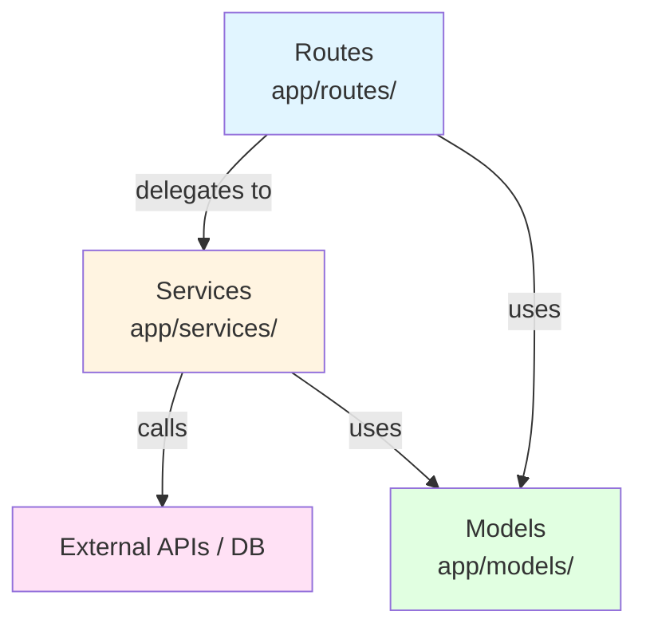
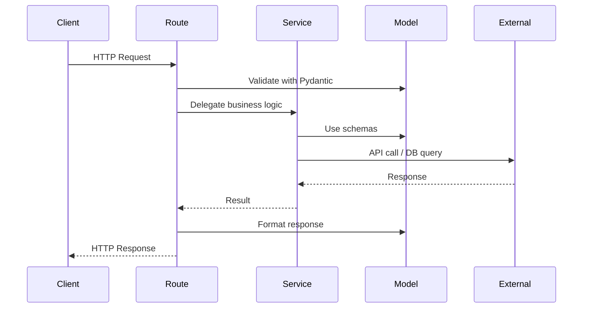

# Architecture

Mnemos is a personal RAG system for managing documents (receipts, manuals, PDFs) with intelligent search and chat. It uses a FastAPI backend with PostgreSQL.

## Layer Structure

The backend follows strict layered architecture with enforced dependency directions:

### Request Flow

### Layer Rules

1. **Routes** (`app/routes/`) - HTTP handlers only. Must be thin. Delegate all logic to services. May import models and services.
2. **Services** (`app/services/`) - Business logic, external API calls, database access. May import models. Must NOT import routes.
3. **Models** (`app/models/`) - Pydantic schemas only. Must NOT import routes or services.
4. **Middleware** (`app/middleware/`) - Request/response processing. May import models. Must NOT import routes or services.
5. **Config** (`app/config.py`) - Pydantic BaseSettings. No business logic.

### Dependency Direction

Dependencies flow **downward only**: Routes -> Services -> Models. Never upward. This is enforced by the structural linter (`backend/scripts/lint_structure.py`).

## File Organization

- One domain per file in models (`ai.py`, `health.py`, `common.py`, `errors.py`)
- One feature per route file (`ai.py`, `health.py`)
- One service per external integration (`openai_service.py`)
- Shared fixtures in `tests/conftest.py`

## Key Patterns

- **Dependency Injection**: FastAPI `Depends()` for services in routes
- **Singleton Services**: Module-level instances, reset in tests via fixtures
- **Async-first**: All route handlers and service methods are async
- **Pydantic Settings**: Environment config via `app/config.py`

## Infrastructure

- **Runtime**: Python 3.12, FastAPI, Uvicorn
- **Database**: PostgreSQL 15 (Alpine), SQLAlchemy 2.0 async, Alembic migrations
- **Containers**: Docker Compose with dev, postgres, and optional production backend services
- **Package Manager**: uv (fast, with lockfile)
