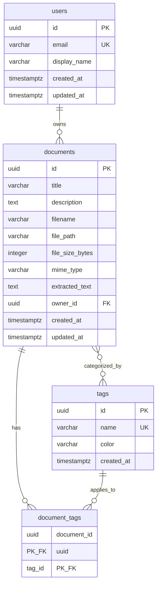

# Database Entity-Relationship Diagram (ERD)

## Visual Schema Representation

This diagram shows the relationships between tables in the Mnemos database.



## Relationship Explanations

### users → documents (One-to-Many)
- **Relationship**: One user can own many documents
- **Foreign Key**: `documents.owner_id` → `users.id`
- **Cascade**: ON DELETE CASCADE (deleting a user deletes all their documents)
- **Description**: Each document belongs to exactly one user (owner)

### documents ↔ tags (Many-to-Many)
- **Relationship**: Documents can have multiple tags, and tags can be applied to multiple documents
- **Association Table**: `document_tags`
- **Foreign Keys**:
  - `document_tags.document_id` → `documents.id`
  - `document_tags.tag_id` → `tags.id`
- **Cascade**: ON DELETE CASCADE (deleting a document or tag removes the association)
- **Description**: Flexible categorization system allowing documents to be tagged with multiple categories

## Key Constraints

### Primary Keys
- All tables use `UUID` as primary key for global uniqueness
- `document_tags` uses composite primary key (`document_id`, `tag_id`)

### Unique Constraints
- `users.email` - Each email address must be unique
- `tags.name` - Each tag name must be unique

### Foreign Keys with CASCADE
All foreign keys use `ON DELETE CASCADE` for automatic cleanup:

1. **documents.owner_id → users.id**
   - Deleting a user automatically deletes all their documents
   
2. **document_tags.document_id → documents.id**
   - Deleting a document automatically removes all its tag associations
   
3. **document_tags.tag_id → tags.id**
   - Deleting a tag automatically removes it from all documents

## Indexes

Optimized for common query patterns:

- `ix_users_email` - Fast user lookup by email (unique)
- `ix_tags_name` - Fast tag lookup by name (unique)
- `ix_documents_owner_id` - Fast retrieval of user's documents
- `document_tags_pkey` - Efficient many-to-many lookups

## Database Schema Features

### UUID Primary Keys
All entities use UUID v4 for primary keys, providing:
- Global uniqueness across distributed systems
- No sequence conflicts
- Better security (non-sequential IDs)

### Timestamps
All main entities track temporal data:
- `created_at` - Record creation time
- `updated_at` - Last modification time (auto-updated)

### Soft Schema Features
- `documents.extracted_text` - Stores OCR/PDF text extraction results
- `tags.color` - Optional hex color for UI categorization
- `documents.description` - Optional user-provided description

## Example Queries

### Get all documents for a user
```sql
SELECT * FROM documents WHERE owner_id = '<user-uuid>';
```

### Get all tags for a document
```sql
SELECT t.* 
FROM tags t
JOIN document_tags dt ON t.id = dt.tag_id
WHERE dt.document_id = '<document-uuid>';
```

### Get all documents with a specific tag
```sql
SELECT d.* 
FROM documents d
JOIN document_tags dt ON d.id = dt.document_id
WHERE dt.tag_id = '<tag-uuid>';
```

### Get user's documents with their tags
```sql
SELECT 
    d.id,
    d.title,
    d.filename,
    array_agg(t.name) as tag_names
FROM documents d
LEFT JOIN document_tags dt ON d.id = dt.document_id
LEFT JOIN tags t ON dt.tag_id = t.id
WHERE d.owner_id = '<user-uuid>'
GROUP BY d.id, d.title, d.filename;
```
